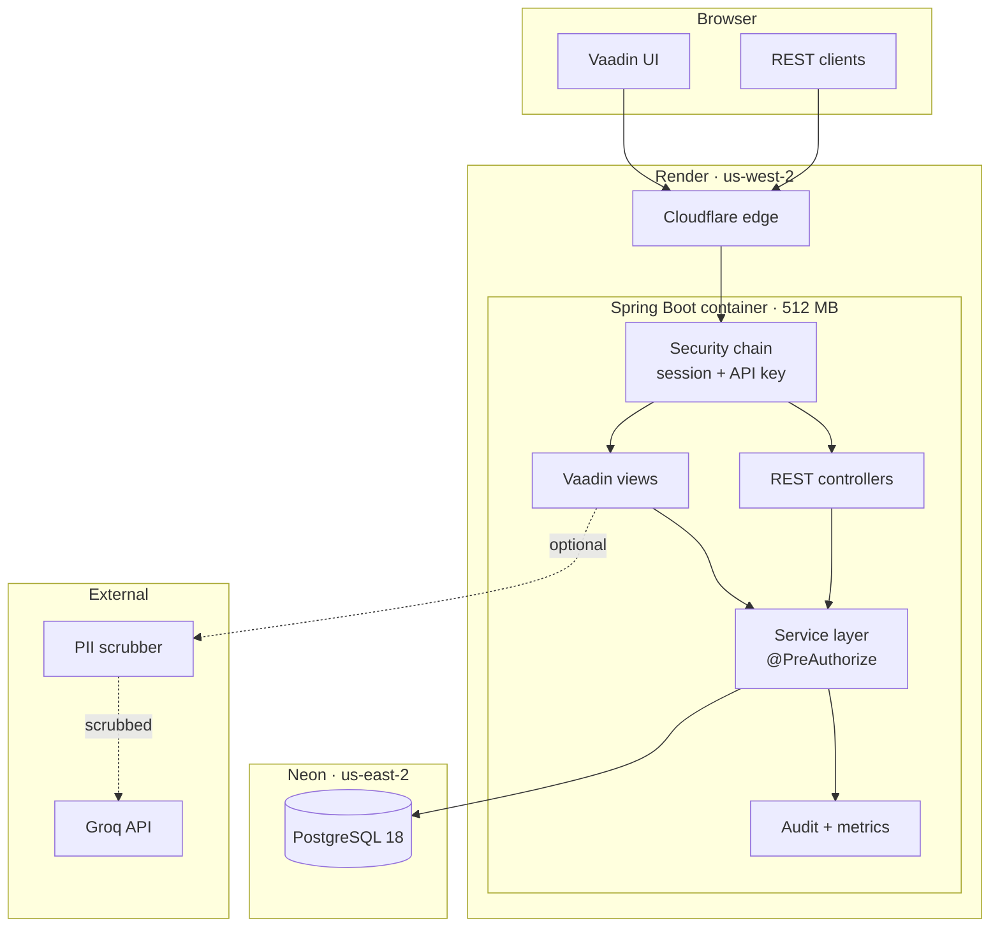
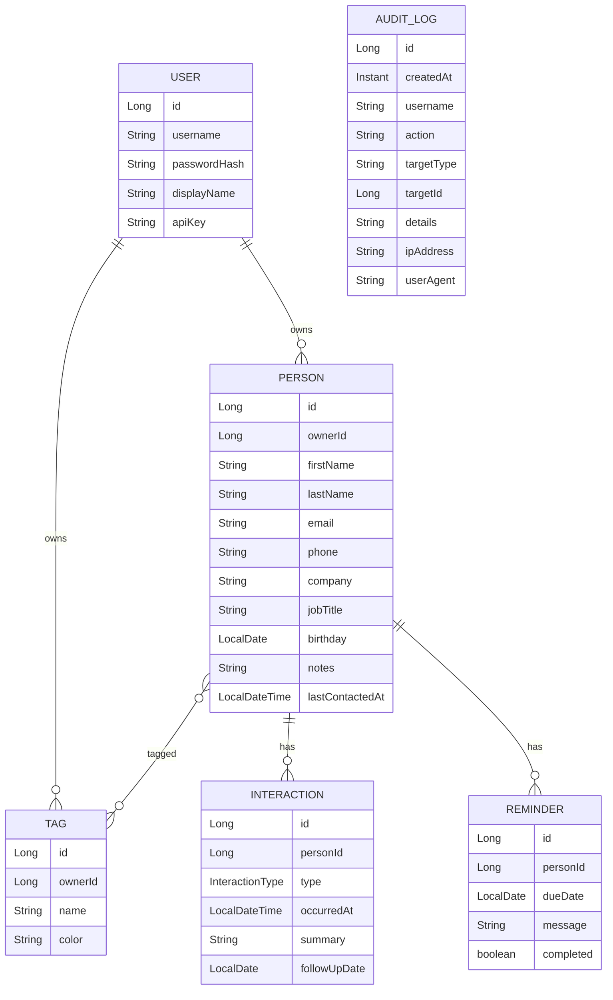
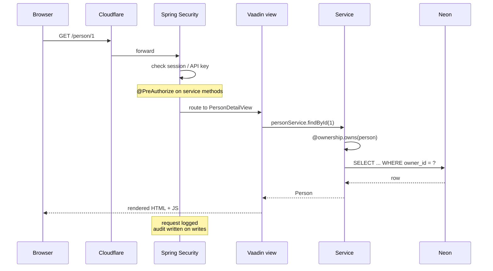

# Luvd1s

A multi-tenant personal CRM. Track contacts, log interactions, see analytics. Built as a full-stack Java application with a Vaadin frontend, a REST API, and production-grade tooling.

[**Live demo**](https://luvd1s.onrender.com) — login with `admin` / `admin123`

> The service runs on Render's free tier and sleeps after 15 minutes of inactivity. First request after a nap takes 30–60 seconds to wake up.

---

## What it does

- **Contacts** — people with tags, companies, roles, birthdays, and notes
- **Interactions** — calls, emails, meetings, coffees, and everything else, with edit/delete
- **Analytics** — frequency of contact over time and interaction type breakdowns, both globally and per-person
- **Dashboard** — stale contacts, upcoming birthdays, tag and company breakdowns
- **AI assistant** — optional, off by default, PII-scrubbed, on-demand chat for questions like "who should I reach out to?"
- **REST API** — CRUD over people, interactions, and tags for any external client
- **Multi-tenant** — every user sees only their own data
- **Debug console** — live request log, audit trail, JVM/pool metrics, Prometheus scrape endpoint

---

## Tech stack

| Layer | Technology |
|---|---|
| Language | Java 21 |
| Framework | Spring Boot 4.1.1 |
| Frontend | Vaadin 25 (Flow, server-side Java UI) |
| Security | Spring Security 7, BCrypt, API keys, method-level authorization |
| Persistence | Spring Data JPA, Hibernate 7, PostgreSQL 18 (Neon) |
| Metrics | Spring Boot Actuator, Micrometer, Prometheus |
| AI | Groq (llama-3.3-70b-versatile) |
| Container | Docker, multi-stage build |
| Hosting | Render (free tier) |
| Database | Neon (free tier) |
| CI | GitHub Actions |

---

## Architecture



---

## Domain model



---

## Request lifecycle



---

## Security model

- **Two filter chains.** `/api/**` is stateless, uses Bearer API keys, and never touches the session. Everything else is cookie-session-based with CSRF protection and the Vaadin login view.
- **Method-level authorization.** Every service write carries `@PreAuthorize("isAuthenticated() and @ownership.owns(#entity)")`. The SpEL expression calls an injected `OwnershipCheck` bean that compares the current user's ID against the entity's owner. Authorization lives next to the code that does the work, not in URL patterns that can drift.
- **API keys.** 32 random bytes, prefixed `lvd_`, unique per user, generated on first boot of an empty database. Sent as `Authorization: Bearer lvd_...`.
- **Username normalization.** Unicode NFC, control/format characters rejected, 3–50 code points. Blocks invisible-character and bidi-override spoofing.
- **Passwords.** BCrypt with the default strength. Never logged, never returned in any DTO.
- **AI boundary.** The chat panel is off by default. When a user opens it, every message they send and every line of CRM context the server assembles is passed through `PiiScrubber` first. Emails, phones, URLs, IPs, `@handles`, and the names of any referenced contacts are replaced with `[redacted-*]` placeholders before the HTTP call to Groq. No automatic AI calls happen anywhere in the app.

---

## Observability

- **Actuator.** `/actuator/health` (public), `/actuator/metrics` and `/actuator/prometheus` (admin only).
- **Custom counters.** Every business event increments a Micrometer counter: `luvd1s_person_created_total`, `luvd1s_interaction_deleted_total`, `luvd1s_audit_written_total`, and eight more. All visible in `/debug`.
- **HTTP metrics.** Percentile histograms enabled for `http.server.requests`, so p50/p95/p99 latencies are available per endpoint.
- **Request buffer.** Every non-static HTTP request is captured in a rolling 50-entry in-memory ring: method, path, user, status, duration. Displayed live on `/debug`.
- **Audit trail.** Every write (create, update, delete) persists an `AuditLog` row with the acting user, target, IP, and user agent. Queryable and shown on `/debug`.

---

## API

Full interactive documentation is available at `/swagger-ui.html` once logged in as admin.

### Authentication

```
Authorization: Bearer lvd_<your-api-key>
```

### Endpoints

| Method | Path | Purpose |
|---|---|---|
| `GET` | `/api/people` | List all contacts |
| `GET` | `/api/people/{id}` | Get one contact |
| `POST` | `/api/people` | Create a contact |
| `PUT` | `/api/people/{id}` | Update a contact |
| `DELETE` | `/api/people/{id}` | Delete a contact |
| `GET` | `/api/people/{id}/interactions` | List interactions for a contact |
| `POST` | `/api/people/{id}/interactions` | Log an interaction |
| `DELETE` | `/api/interactions/{id}` | Delete an interaction |
| `GET` | `/api/tags` | List the current user's tags |
| `GET` | `/api/health` | Public health check |

### Example

```bash
curl -s -H "Authorization: Bearer $KEY" \
  https://luvd1s.onrender.com/api/people/1/interactions

curl -s -X POST -H "Authorization: Bearer $KEY" \
  -H "Content-Type: application/json" \
  -d '{"type":"call","summary":"Quick catch-up"}' \
  https://luvd1s.onrender.com/api/people/1/interactions
```

---

## Running locally

Prerequisites: Java 21, Docker (for the integration tests' Postgres container).

```bash
git clone https://github.com/correspondenceadg-cmyk/Luvd1s.git
cd Luvd1s
./mvnw spring-boot:run
```

The app boots on `http://localhost:8080`. It uses an in-memory H2 database by default. Register an account on `/register` and log in.

### Integration tests

```bash
./mvnw verify
```

This spins up a throwaway PostgreSQL 17 container via Testcontainers and runs the full suite against it. Nothing is left behind — the container is torn down when the JVM exits.

---

## Deployment

The app is deployed to Render as a Docker container. The Dockerfile is a multi-stage build that compiles the Maven project inside the first stage and copies the fat JAR into a slim JRE image for the runtime stage.

### Environment variables

| Variable | Purpose |
|---|---|
| `DB_URL` | JDBC URL for Postgres (must start with `jdbc:postgresql://`) |
| `DB_USERNAME` | Database user |
| `DB_PASSWORD` | Database password |
| `GROQ_API_KEY` | Optional. If unset, the AI chat panel is disabled. |

The database itself is a Neon free-tier Postgres instance in `us-east-2`. Render runs in `us-west-2`. Cross-region latency is acceptable for this workload.

### CI

GitHub Actions runs on every push:

1. Checkout
2. JDK 21 setup
3. Maven cache
4. `./mvnw verify` — unit tests via Surefire, integration tests via Failsafe + Testcontainers
5. Test report upload on failure

---

## Design decisions worth noting

**Vaadin over a JS framework.** The entire frontend is written in Java, type-checked by the compiler, and shares the same object graph as the backend. No DTO mapping between UI and domain, no separate build system for the client. The trade-off is that Vaadin owns the HTML, which limits how far you can customize the DOM.

**Two security chains, not one.** Attempting to run `/api/**` and the Vaadin UI through the same `SecurityFilterChain` produced a series of subtle bugs — CSRF redirects on API POSTs, session statelessness leaks, entry-point precedence conflicts. Splitting them is the pattern Vaadin's own docs recommend for hybrid apps. It costs one `@Order` annotation and pays for itself immediately.

**`@PreAuthorize` on services, not on controllers.** The controller layer is thin and easy to refactor; the service layer is where invariants live. Putting authorization next to the invariant means a URL re-route can't accidentally expose a protected operation.

**PII scrubber as a hard boundary.** The AI is a genuine feature, but it's also the app's biggest external dependency from a privacy standpoint. Keeping the AI strictly opt-in, scrubbing on the server side, and never auto-invoking it means a user can go a whole session without a single byte leaving the app.

**Hand-rolled SVG charts.** Vaadin Charts is a Pro component. Rather than pay for a license or pull in a heavyweight chart library for three chart types, the line and bar charts are built from `div`/`svg` elements directly. About 200 lines total, no dependencies, and they theme correctly in dark mode because they use Lumo CSS variables.

---

## Notable constraints

- **512 MB container.** Render's free tier caps at 512 MB. JVM flags (`-XX:MaxRAMPercentage=50`, `-XX:+UseSerialGC`, `-XX:TieredStopAtLevel=1`) keep the process comfortably under that.
- **Free tier cold starts.** The service sleeps after 15 minutes of inactivity. UptimeRobot pings `/actuator/health` every 5 minutes to keep it warm.
- **Neon free tier.** Auto-suspends after 5 minutes idle, 100 compute-hours per month. Wakes on next query. Persistent storage survives Render redeploys — the app's data does not reset when the container restarts.

---

---

[](https://gitdiagram.com/correspondenceadg-cmyk/luvd1s?utm_source=readme&utm_medium=picture)

---


## License

MIT. See [LICENSE](LICENSE).

## Author

[correspondenceadg-cmyk](https://github.com/correspondenceadg-cmyk)